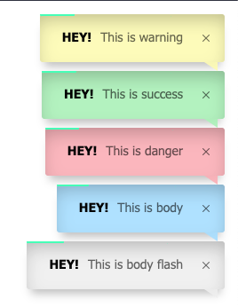

# Elegant Flash Message Wrapper For Laravel


[](https://packagist.org/packages/nicoaudy/noty)
[](https://packagist.org/packages/nicoaudy/noty)
[](https://packagist.org/packages/nicoaudy/noty)

This is a elegant and configurable notify package to send flash messages in Laravel apps. A flash message is a message that is carried over to the next request by storing it in the session.





This is how it can be used:

## Installation

You can install the package via composer:

```bash
composer require nicoaudy/noty
```

You can publish the config file with:

```bash
php artisan vendor:publish --provider="Nicoaudy\Noty\NotyServiceProvider"
```

This is the contents of the published config file:

```php
return [
    /*
    * Title configuration color
    */
    'titleColor' => '',

    /*
    * Title configuration size
    */
    'titleSize' => '',

    /*
    * Title configuration line hight
    */
    'titleLineHeight' => '',

    /*
    * Message configuration color
    */
    'messageColor' => '',

    /*
    * Message configuration size
    */
    'messageSize' => '',

    /*
    * Message configuration line hight
    */
    'messageLineHeight' => '',

    /*
     * Positions:  bottomRight, bottomLeft, topRight, topLeft, topCenter, bottomCenter, center
     */
    'position' => 'topRight',

    /*
     * Themes:  light, dark
     */
    'theme' => 'light',

    /*
     * Layout:  1 (title inline with message), 2 (title on top of message)
     */
    'layout' => 1,

    /*
    * [integer|boolean] - Delay for closing event in milliseconds. Set false for sticky notifications.
    */
    'timeout' => 4000,

    /*
     * [boolean] - Displays a progress bar.
     */
    'progressBar' => true,

    /*
     * [string] - Progress bar color
     */
    'progressBarColor' => 'rgb(0, 255, 184)',

    /*
     * [string] - Progress bar linear / ease
     */
    'progressBarEasing' => 'linear',

    /*
     * [boolean] - Balloon
     */
    'balloon' => true,

    /*
     * [boolean] - enable to close?
     */
    'close' => true,

    /*
     * [boolean] - Close on click
     */
    'closeOnClick' => false,

    /*
     * [boolean] - Close on escape?
     */
    'closeOnEscape' => false,

    /*
     * Animate inside
     */
    'animateInside' => true, // bool

    /*
     * Enable drag for close
     */
    'drag' => true, // bool

    /*
     * Pause on hover
     */
    'pauseOnHover' => true, // bool

    /*
     * Reset on hover
     */
    'resetOnHover' => false, // bool

    /*
     * [string] - Transition In
     * Default toast open animation. It can be: bounceInLeft, bounceInRight, bounceInUp, bounceInDown, fadeIn, fadeInDown, fadeInUp, fadeInLeft, fadeInRight or flipInX.
     */
    'transitionIn' => 'fadeInUp',

    /*
     * [string] - Transition Out
     * Default toast close animation. It can be: fadeOut, fadeOutUp, fadeOutDown, fadeOutLeft, fadeOutRight, flipOutX
     */
    'transitionOut' => 'fadeOut',

    /*
     * [string] - Transition In Mobile
     */
    'transitionInMobile' => 'fadeInUp',

    /*
     * [string] - Transition Out Mobile
     */
    'transitionOutMobile' => 'fadeOutDown',
];
```

## Usage

Within your controllers, before you perform a redirect, make a call to the noty() function.

```php
public function store()
{
    noty()->flash('Cool', 'Your data has been saved');

    return home();
}
```

You may also do:

```php
noty()->flash('Hey!', 'This is message');
noty()->info('Hey!', 'This is message');
noty()->success('Hey!', 'This is message');
noty()->warning('Hey!', 'This is message');
noty()->error('Hey!', 'This is message');
```

With this message flashed to the session, you may now display it in your view(s). Because flash messages are so common, we provide a template out of the box to get you started. Place this before end of the body tag.

```php
    {{ noty_assets() }}
</body>
```

## Testing

```bash
composer test
```

## Changelog

Please see [CHANGELOG](CHANGELOG.md) for more information on what has changed recently.

## Contributing

Please see [CONTRIBUTING](CONTRIBUTING.md) for details.

## Security

If you discover any security related issues, please email freek@spatie.be instead of using the issue tracker.

## Credits

-   [Nico Audy](https://github.com/NicoAudy)
-   [All Contributors](../../contributors)

## License

The MIT License (MIT). Please see [License File](LICENSE.md) for more information.
